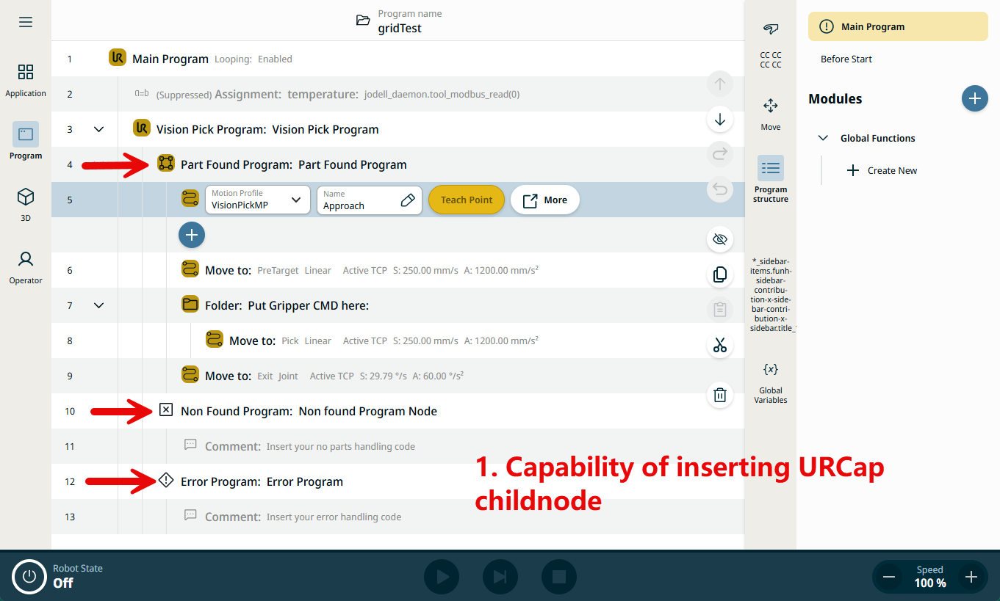
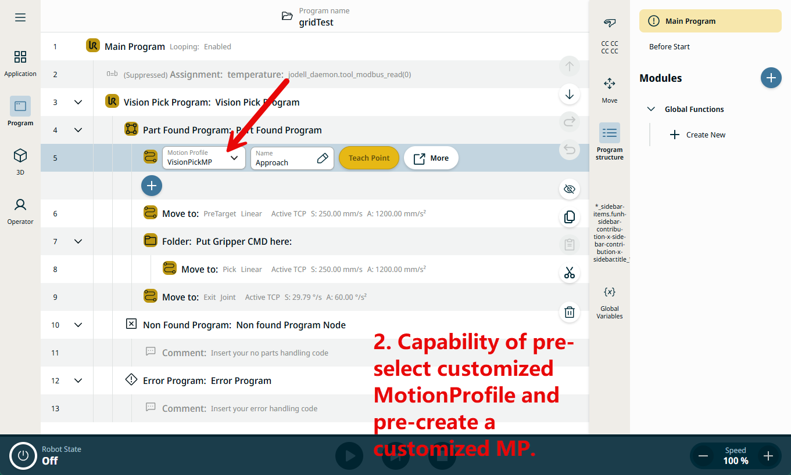
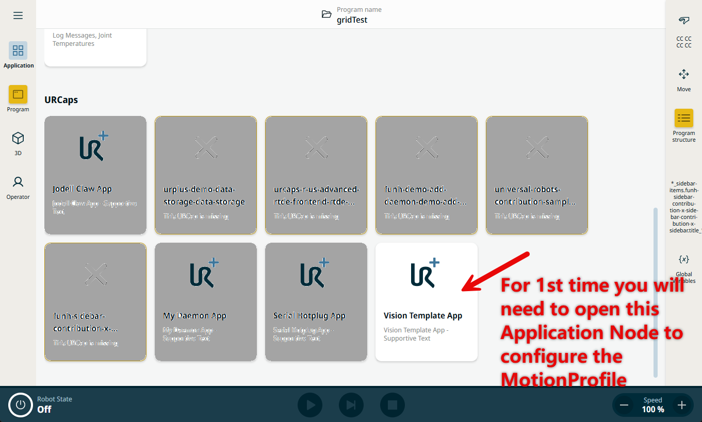
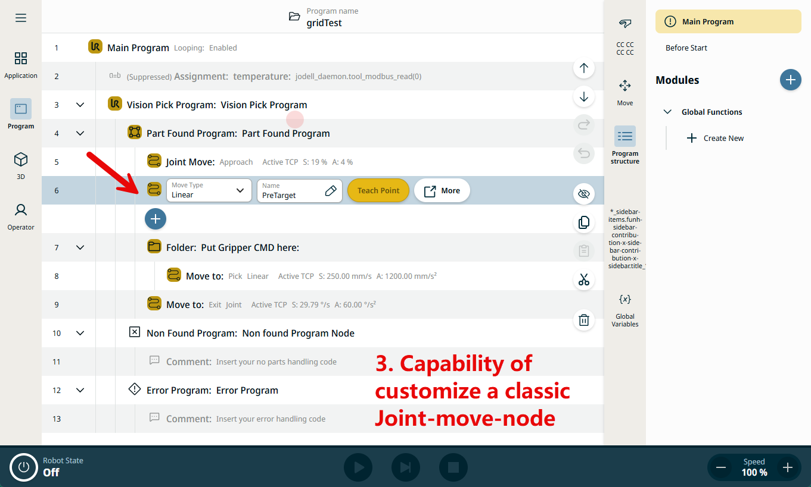
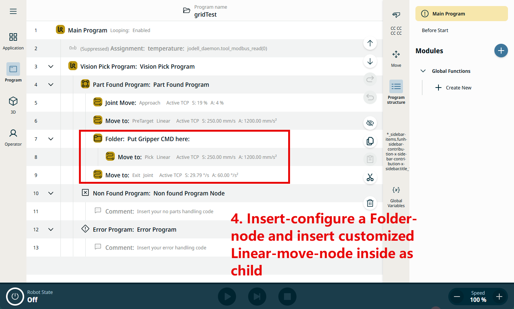
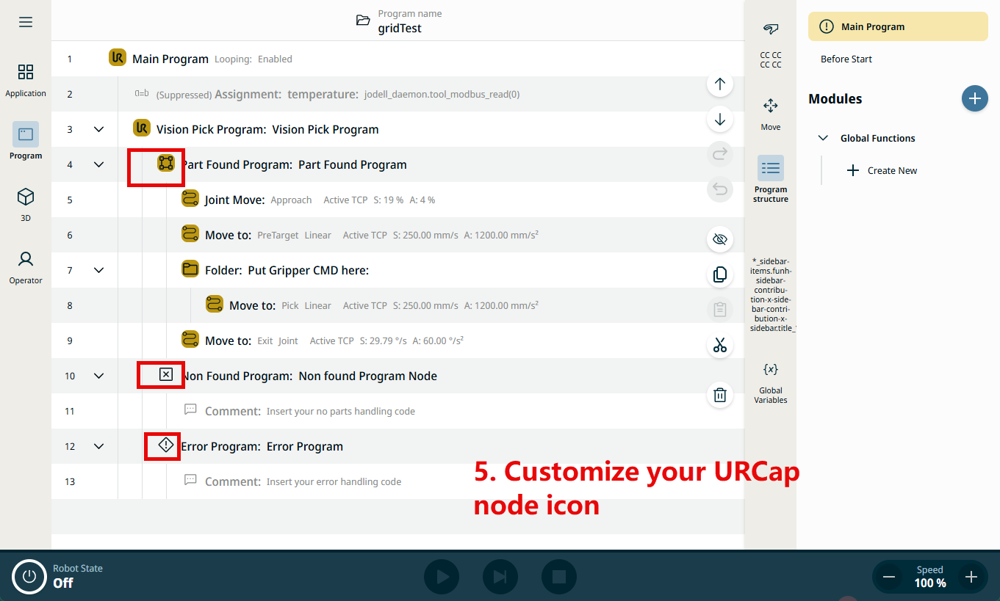

# Angular contribution

## Features of this sample

to achieve that, you will first need to open 1 time Application Node to permit its initialization.

This project is a template Angular example of a URCap Web Contribution

### Installation

To install the contribution type:

`$ npm install`

### Build

To build the contribution type:

`$ npm run build`

### Deploy

To deploy the contribution to the simulator type:

`$ npm run install-urcap`

## Further help

Get more help from the included SDK documentation.
