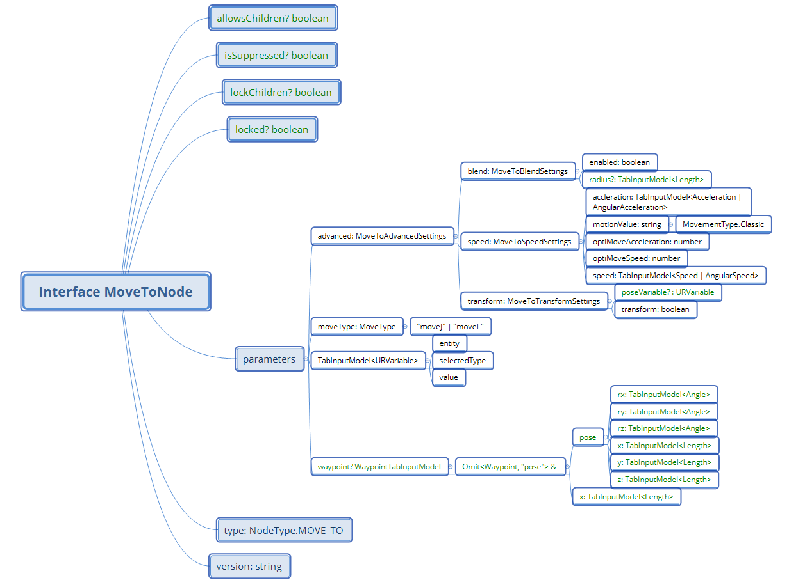

# Configuration of a MoveToNode

This article explains a MoveToNode configuration in SDK.


### General information:

Author: FuNing Hu (funh@universal-robots.com)

Completion date: 2025-April-15

Location: CN Shanghai


### The environment prerequisite:

- [x] SDK 0.15,

- [x] URSIM 10.8


This is the mapping of MoveToNode interface, actually all non-question-mark components need to configure before it could properly run in Polyscope. and below we shall do a complete step-by-step setting for all those necessary coding to configure a MoveToNode. 



in this urcap example to simplify configuring MoveToNode, a method *createMoveToNode(moveType, suggestedName)* is created.


### 1. Initialization

```typescript
//create movetonode instance
const builder = new ProgramBehaviorAPI(self).builder;
const movetonode = (await builder.createNode(NodeType.MOVE_TO)) as MoveToNode;
const symbolService = new ProgramBehaviorAPI(self).symbolService;
movetonode.parameters.variable = new TabInputModel<URVariable>(pointName, 'VALUE', pointName.name);
movetonode.parameters.moveType = moveType;
movetonode.type = NodeType.MOVE_TO;
movetonode.version = "1.0.0";
```


### 2. MoveToBlendSettings configuration

```typescript
const blendSettings: MoveToBlendSettings = {
        enabled: true,
        radius: new TabInputModel<Length>(
            {
                value: SHARED_BLEND_RADIUS_IN_M, 
                // this is constant variable exported from other file.
                
                unit: LengthUnits[0], //meter
            },
            SelectedInput.VALUE,
            SHARED_BLEND_RADIUS_IN_M,
        ),
    };
```


### 3. MoveToSpeedSettings configuration

```typescript
const speedAngularSettings: MoveToSpeedSettings={
        acceleration: new TabInputModel<Acceleration>(
            {
                value: SHARED_ANGULAR_ACCELERATION_IN_RAD_S2,
                // this is constant variable exported from other file.
                
                unit: AngularAccelerationUnits[0], //rad/s2
            },
            SelectedInput.VALUE,
            SHARED_ANGULAR_ACCELERATION_IN_RAD_S2
            // this is constant variable exported from other file.
        ),
        speed: new TabInputModel<Speed>(
            {
                value: SHARED_ANGULAR_SPEED_IN_RAD_S,
                unit: AngularSpeedUnits[0], //rad/s2
            },
            SelectedInput.VALUE,
            SHARED_ANGULAR_SPEED_IN_RAD_S
        ),
        motionValue: MovementType.Classic,
        optiMoveSpeed: 0,
        optiMoveAcceleration: 0
    }
    const speedLinearSettings: MoveToSpeedSettings={
        acceleration: new TabInputModel<Acceleration>(
            {
                value: SHARED_TOOL_ACCELERATION_IN_M_S2,
                // this is constant variable exported from other file.
                
                unit: AccelerationUnits[0], //meter/s2
            },
            SelectedInput.VALUE,
            SHARED_TOOL_ACCELERATION_IN_M_S2
        ),
        speed: new TabInputModel<Speed>(
            {
                value: SHARED_TOOL_SPEED_IN_M_S,
                // this is constant variable exported from other file.
                
                unit: SpeedUnits[0], //meter/s
            },
            SelectedInput.VALUE,
            SHARED_TOOL_SPEED_IN_M_S
        ),
        motionValue: MovementType.Classic,
        optiMoveSpeed: 0,
        optiMoveAcceleration: 0
    };
```


### 4. MoveToTransformSettings configuration

```typescript
const transformSettings: MoveToTransformSettings={
        transform: false
    };
```


### 5. Assembly

```typescript
movetonode.parameters.advanced = {
        speed: moveType === 'moveL'? speedLinearSettings : speedAngularSettings,
        blend: blendSettings,
        transform: transformSettings
    };
```


### 6. Function full code

```typescript
async function createMoveToNode(moveType: MoveType, suggestedName: string): Promise<MoveToNode>{
    const builder = new ProgramBehaviorAPI(self).builder;
    const movetonode = (await builder.createNode(NodeType.MOVE_TO)) as MoveToNode;
    const symbolService = new ProgramBehaviorAPI(self).symbolService;
    const pointName = await symbolService.generateVariable(suggestedName, VariableValueType.WAYPOINT);
    movetonode.parameters.variable = new TabInputModel<URVariable>(pointName, 'VALUE', pointName.name);
    movetonode.parameters.moveType = moveType;
    movetonode.type = NodeType.MOVE_TO;
    movetonode.version = "1.0.0";

    const blendSettings: MoveToBlendSettings = {
        enabled: true,
        radius: new TabInputModel<Length>(
            {
                value: SHARED_BLEND_RADIUS_IN_M,
                unit: LengthUnits[0], //meter
            },
            SelectedInput.VALUE,
            SHARED_BLEND_RADIUS_IN_M,
        ),
    };
    const speedAngularSettings: MoveToSpeedSettings={
        acceleration: new TabInputModel<Acceleration>(
            {
                value: SHARED_ANGULAR_ACCELERATION_IN_RAD_S2,
                unit: AngularAccelerationUnits[0], //rad/s2
            },
            SelectedInput.VALUE,
            SHARED_ANGULAR_ACCELERATION_IN_RAD_S2
        ),
        speed: new TabInputModel<Speed>(
            {
                value: SHARED_ANGULAR_SPEED_IN_RAD_S,
                unit: AngularSpeedUnits[0], //rad/s2
            },
            SelectedInput.VALUE,
            SHARED_ANGULAR_SPEED_IN_RAD_S
        ),
        motionValue: MovementType.Classic,
        optiMoveSpeed: 0,
        optiMoveAcceleration: 0
    }
    const speedLinearSettings: MoveToSpeedSettings={
        acceleration: new TabInputModel<Acceleration>(
            {
                value: SHARED_TOOL_ACCELERATION_IN_M_S2,
                unit: AccelerationUnits[0], //meter/s2
            },
            SelectedInput.VALUE,
            SHARED_TOOL_ACCELERATION_IN_M_S2
        ),
        speed: new TabInputModel<Speed>(
            {
                value: SHARED_TOOL_SPEED_IN_M_S,
                unit: SpeedUnits[0], //meter/s
            },
            SelectedInput.VALUE,
            SHARED_TOOL_SPEED_IN_M_S
        ),
        motionValue: MovementType.Classic,
        optiMoveSpeed: 0,
        optiMoveAcceleration: 0
    };
    const transformSettings: MoveToTransformSettings={
        transform: false
    };
    movetonode.parameters.advanced = {
        speed: moveType === 'moveL'? speedLinearSettings : speedAngularSettings,
        blend: blendSettings,
        transform: transformSettings
    };
    ////////end of movenode settings////////////////////

    return movetonode;
}

//...
//calling example
const moveJApproachNode = await createMoveToNode("moveJ", "Approach");
//creating a joint move node with "Approach" as suggested name, it is using classic movetype and with pre-defined joint motion parameters.

const moveLTargetNode = await createMoveToNode("moveL", "Target");
//createing a joint move node with "Target" as suggested name, it is using clasic movetype and with pre-defined linear motion parameters.

//const moveJExitNode = await createMoveToNode("moveJ", "Exit");
```


### -end-