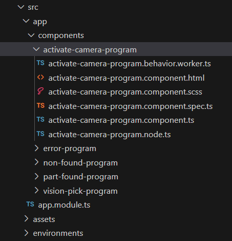

# Procedure create addition program node

This article explains step-by-step workflow to create a program node in your URCap project in PolyscopeX.


### General Information:

Author: FuNing Hu (funh@universal-robots.com)

Completion date: 2025-April-15

Location: CN Shanghai


### The environment prerequisite: 

- [x] SDK 0.15, 
- [x] URSIM 10.8


This is a typical program folder structure in a URCap project, and I want to add an additional program node into project, let's name it "activate-camera-program"


### Step 1: Create node files under /src/app/components

It would be easier to duplicate an existing node together with it's sub 6 files into a new folder under same directory of components, and rename all their name to "activate-camera-program-xxxx", like below:



### Step-2: update file <activate-camera-program.node.ts>

```typescript
import { ProgramNode } from '@universal-robots/contribution-api';

export interface ActivateCameraProgramNode extends ProgramNode {
    type: string;
    parameters?: {
        [key: string]: unknown;
    };
    lockChildren?: boolean;
    allowsChildren?: boolean;
}

```


### Step-3: update file <activate-camera-program.component.ts>

Update corresponding names of import component/templateUrl/styleUrls/class/Input, as below:

```typescript
import { ChangeDetectionStrategy, ChangeDetectorRef, Component, Input, OnChanges, SimpleChanges } from '@angular/core';
import { TranslateService } from '@ngx-translate/core';
import { ProgramPresenter, ProgramPresenterAPI, RobotSettings } from '@universal-robots/contribution-api';
import { ActivateCameraProgramNode } from './activate-camera-program.node';
import { first } from 'rxjs/operators';

@Component({
    templateUrl: './activate-camera-program.component.html',
    styleUrls: ['./activate-camera-program.component.scss'],
    changeDetection: ChangeDetectionStrategy.OnPush,
    standalone: false
})

export class ActivateCameraComponent implements OnChanges, ProgramPresenter {
    // presenterAPI is optional
    @Input() presenterAPI: ProgramPresenterAPI;

    // robotSettings is optional
    @Input() robotSettings: RobotSettings;
    // contributedNode is optional
    @Input() contributedNode: ActivateCameraProgramNode;

    constructor(
        protected readonly translateService: TranslateService,
        protected readonly cd: ChangeDetectorRef
    ) {
    }

    ngOnChanges(changes: SimpleChanges): void {
        if (changes?.robotSettings) {
            if (!changes?.robotSettings?.currentValue) {
                return;
            }

            if (changes?.robotSettings?.isFirstChange()) {
                if (changes?.robotSettings?.currentValue) {
                    this.translateService.use(changes?.robotSettings?.currentValue?.language);
                }
                this.translateService.setDefaultLang('en');
            }

            this.translateService
                .use(changes?.robotSettings?.currentValue?.language)
                .pipe(first())
                .subscribe(() => {
                    this.cd.detectChanges();
                });
        }
    }

    // call saveNode to save node parameters
    async saveNode() {
        this.cd.detectChanges();
        await this.presenterAPI.programNodeService.updateNode(this.contributedNode);
    }
}

```


### Step-4 revise <activate-camera-program.component.spec.ts> corresponding part

```typescript
import {ComponentFixture, TestBed} from '@angular/core/testing';
import {ActivateCameraComponent} from "./activate-camera-program.component";
import {TranslateLoader, TranslateModule} from "@ngx-translate/core";
import {Observable, of} from "rxjs";

describe('ActivateCameraComponent', () => {
  let fixture: ComponentFixture<ActivateCameraComponent>;
  let component: ActivateCameraComponent;

  beforeEach(() => {
    TestBed.configureTestingModule({
      declarations: [ActivateCameraComponent],
      imports: [TranslateModule.forRoot({
        loader: {
          provide: TranslateLoader, useValue: {
            getTranslation(): Observable<Record<string, string>> {
              return of({});
            }
          }
        }
      })],
    }).compileComponents();

    fixture = TestBed.createComponent(ActivateCameraComponent);
    component = fixture.componentInstance;
  });

  it('should create the component', () => {
    expect(component).toBeTruthy();
  });
});

```


### Step-5 update <activate-camera-program.component.html> display label, 

you can revise it later for a proper design.

```html
<div *ngIf="contributedNode" class="inline-component">
    <p>Activate camera Prog. node works!!!</p>
</div>

```


### Step-6 Update <activate-camera-program.behavior.worker.ts>.

```typescript
/// <reference lib="webworker" />
import {
    InsertionContext,
    OptionalPromise,
    ProgramBehaviors,
    ProgramNode,
    registerProgramBehavior,
    ScriptBuilder,
    ValidationContext,
    ValidationResponse
} from '@universal-robots/contribution-api';
import { ActivateCameraProgramNode } from './activate-camera-program.node';

// programNodeLabel is required
const createProgramNodeLabel = (node: ActivateCameraProgramNode): OptionalPromise<string> => 'Activate Program';

// factory is required
const createProgramNode = (): OptionalPromise<ActivateCameraProgramNode> => ({
    type: 'funh-vision-template-x-activate-camera-program', 
    //!!!Remarkable this type will be used in many place, and should always be consistant.
    version: '1.0.0',
    lockChildren: false,
    allowsChildren: false,
    parameters: {
    },
});

// generateCodeBeforeChildren is optional
const generateScriptCodeBefore = (node: ActivateCameraProgramNode): OptionalPromise<ScriptBuilder> => new ScriptBuilder();

// generateCodeAfterChildren is optional
const generateScriptCodeAfter = (node: ActivateCameraProgramNode): OptionalPromise<ScriptBuilder> => new ScriptBuilder();

// generateCodePreamble is optional
const generatePreambleScriptCode = (node: ActivateCameraProgramNode): OptionalPromise<ScriptBuilder> => new ScriptBuilder();

// validator is optional
const validate = (node: ActivateCameraProgramNode, validationContext: ValidationContext): OptionalPromise<ValidationResponse> => ({
    isValid: true
});

// allowsChild is optional
const allowChildInsert = (node: ProgramNode, childType: string): OptionalPromise<boolean> => true;

// allowedInContext is optional
const allowedInsert = (insertionContext: InsertionContext): OptionalPromise<boolean> => true;

// upgradeNode is optional
const nodeUpgrade = (loadedNode: ProgramNode): ProgramNode => loadedNode;

const behaviors: ProgramBehaviors = {
    programNodeLabel: createProgramNodeLabel,
    factory: createProgramNode,
    generateCodeBeforeChildren: generateScriptCodeBefore,
    generateCodeAfterChildren: generateScriptCodeAfter,
    generateCodePreamble: generatePreambleScriptCode,
    validator: validate,
    allowsChild: allowChildInsert,
    allowedInContext: allowedInsert,
    upgradeNode: nodeUpgrade
};

registerProgramBehavior(behaviors);

```


### Step-7 Copy the type string to i18n

in Step-6's createProgramNode method and past in /src/assets/i18n/en.json, as below:

```json
{
  "program": {
    "tree": {
      "nodes": {
        "funh-vision-template-x-vision-pick-program": "Vision Pick Program",
        "funh-vision-template-x-part-found-program": "Part Found Program",
        "funh-vision-template-x-non-found-program": "Non Found Program",
        "funh-vision-template-x-error-program": "Error Program",
        "funh-vision-template-x-activate-camera-program": "Activate Camera"
      }
    }
  }
}

```


### Step-8 Declaration in /src/app/app.module.ts

Notable there are 3 major section needs to add info, 

- declarations
- ngDoBootstrap
- registerWorkersWithWebPack

```typescript
import { DoBootstrap, Injector, NgModule } from '@angular/core';
import { VisionPickProgramComponent } from './components/vision-pick-program/vision-pick-program.component';
import { UIAngularComponentsModule } from '@universal-robots/ui-angular-components';
import { BrowserModule } from '@angular/platform-browser';
import { createCustomElement } from '@angular/elements';
import { HttpBackend, HttpClientModule } from '@angular/common/http';
import { TranslateLoader, TranslateModule } from '@ngx-translate/core';
import {MultiTranslateHttpLoader} from 'ngx-translate-multi-http-loader';
import { PATH } from '../generated/contribution-constants';
import {BrowserAnimationsModule} from "@angular/platform-browser/animations";
import { ActivateCameraComponent } from './components/activate-camera-program/activate-camera-program.component';
import { ActiveDescendantKeyManager } from '@angular/cdk/a11y';
export const httpLoaderFactory = (http: HttpBackend) =>
    new MultiTranslateHttpLoader(http, [
        { prefix: PATH + '/assets/i18n/', suffix: '.json' },
        { prefix: './ui/assets/i18n/', suffix: '.json' },
    ]);

@NgModule({
    declarations: [
        // ... other components
        ActivateCameraComponent, //should declare your component here!
    ],
    imports: [
        BrowserModule,
        BrowserAnimationsModule,
        UIAngularComponentsModule,
        HttpClientModule,
        TranslateModule.forRoot({
            loader: { provide: TranslateLoader, useFactory: httpLoaderFactory, deps: [HttpBackend] },
            useDefaultLang: false,
        })
    ],
    providers: [],
})

export class AppModule implements DoBootstrap {
    constructor(private injector: Injector) {
    }

    ngDoBootstrap() {
        // other node's customElements define
        // ...
        const activatecameraprogramComponent = createCustomElement(ActiveDescendantKeyManager, {injector: this.injector});
        customElements.define('funh-vision-template-x-activate-camera-program', activatecameraprogramComponent);
    }

    // This function is never called, because we don't want to actually use the workers, just tell webpack about them
    registerWorkersWithWebPack() {
        
        // other node's worker registration
        //....
        
        new Worker(new URL('./components/activate-camera-program/activate-camera-program.behavior.worker.ts'
            /* webpackChunkName: "activate-camera-program.worker" */, import.meta.url),{
            name: 'activate-camera',
            type: 'module'
        });
    }
}


```


### Step-9 Add one part in <contribution.json> 

in project root folder. Here again, the **type value** specified in Step-6 is used.

```json
{
  "applicationNodes": [],
  "programNodes": [
    //other program nodes configuration
    {
      "excludeFromToolbox": false, //setting false means it will showup in the Tool box in Program page, otherwise it will only possible be inserted through other node.
      "translationPath":"assets/i18n/",
      "iconURI":"assets/icons/arrow-fat-right.svg",
      "behaviorURI": "activate-camera-program.worker.js",
      "presenterURI":"main.js",
      "componentTagName": "funh-vision-template-x-activate-camera-program"
    }
  ],
  "smartSkills": []
}

```


### Step-10 recompile project 

and re-install to check whether it runs properly in your simulator.


### -end-